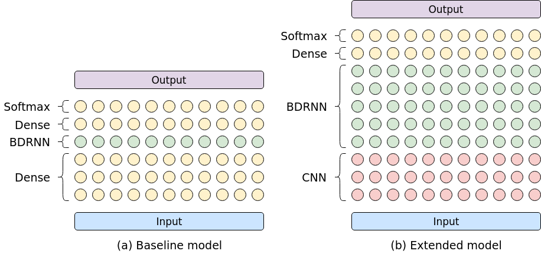

# End-to-End Speech Recognition System Using Connectionist Temporal Classification
Automatic speech recognition (ASR) system implementation that utilizes the 
[connectionist temporalclassification (CTC)](http://citeseerx.ist.psu.edu/viewdoc/summary?doi=10.1.1.75.6306)
cost function.
It is inspired by Baidu's
[Deep Speech: Scaling up end-to-end speech recognition](https://arxiv.org/abs/1412.5567)
and
[Deep Speech 2: End-to-End Speech Recognition in English and Mandarin](https://arxiv.org/abs/1512.02595)
papers.
The system is trained on a combined corpus, containing 900+ hours.
It achieves a word error rate (WER) of 12.6% on the test dataset, without the use of an external
language model.



(a) shows the Deep Speech (1) model and (b) a version of the Deep Speech 2 model architecture. 


## Contents
* [Installation](#installation)
  * [Arch Linux](#arch-linux)
  * [Ubuntu](#ubuntu)
* [Configuration](#configuration)
* [Datasets](#datasets)
* [Training](#training)
* [Evaluation](#evaluation)
* [License](#license)


## Installation
The system was tested on Arch Linux and Ubuntu 16.04, with Python version 3.5+ and the 1.9.0 version
of [TensorFlow](https://www.tensorflow.org/). It is highly recommended to use TensorFlow with GPU
support for training.


### Arch Linux
```sh
# Install dependencies.
pacman -S sox python-tensorflow-opt-cuda tensorbaord

# Clone reposetory and install Python depdendencies.
git clone <URL>
cd speech
pip install -r requirements.txt
```

### Ubuntu
Be aware that the [requirements.txt](requirements.txt) lists `tensorflow` as dependency, if you
install TensorFlow through [pip](https://pypi.org/project/pip/) consider removing it and install 
`tensorflow-gpu` manually.
Based on my experience it is worth the effort to 
[build TensorFlow from source](https://www.tensorflow.org/install/source).

```sh
# Install dependencies.
sudo apt install python3-tk sox libsox-fmt-all

# Clone reposetory and install Python depdendencies. Don't forget tensorflow-gpu.
git clone <URL>
cd speech
pip3 install -r requirements.txt
```


## Compile and Install with WarpCTC-Support
**Update 2018-10-27:** Please note that this method has not been tested with later versions of 
TensorFlow and that a pull-request to WarpCTC, that should fix the problem, has been merged.


### Compile TensorFlow
```sh
# Tensorflow
git clone https://github.com/tensorflow/tensorflow
cd tensorflow

# Checkout the desired version (e.g. rolling `r1.9` or release `v1.9.0`).
git checkout v1.9.0

# Run config wizard
./configure

# Build tensorflow
bazel build --config=opt --config=cuda --cxxopt="-D_GLIBCXX_USE_CXX11_ABI=0" //tensorflow/tools/pip_package:build_pip_package

# Build pip installer
bazel-bin/tensorflow/tools/pip_package/build_pip_package /tmp/tensorflow_pkg

# Install or upgrade package.
sudo pip install /tmp/tensorflow_pkg/tensorflow-X.X.X-cp35-cp35m-linux_x86_64.whl
sudo pip install -U /tmp/tensorflow_pkg/tensorflow-X.X.X-cp35-cp35m-linux_x86_64.whl
```


### Compile WarpCTC
```sh
# Back to base folder
cd ..

# Set environment variables.
export CUDA_HOME="/usr/local/cuda"
export TENSORFLOW_SRC_PATH="/home/marc/workspace/tensorflow"
export WARP_CTC_PATH="/home/marc/workspace/warp-ctc/build"

git clone https://vcs.zwuenf.org/mdangschat/warp-ctc.git
cd warp-ctc

mkdir build && cd build
cmake ../
make

# Install TensorFlow python bindings/
cd ../tensorflow_binding
python setup.py install

# Test Warp CTC.
python setup.py test
```

Reference [installing TensorFlow from Sources](https://www.tensorflow.org/install/install_sources) 
and 
[TensorFlow binding for WarpCTC](https://github.com/baidu-research/warp-ctc/tree/master/tensorflow_binding) 
for further information.


## Configuration
The network architecture and training parameters can be configured by adding the appropriate flags
or by directly editing the [params.py](python/params.py) configuration file.


## Datasets
The following datasets were used for training and are listed in the `data` directory, however, the
individual datasets are not part of the repository and have to be acquired by each user.

* [Mozilla Common Voice](https://voice.mozilla.org/en/new) (v1)
* [LibriSpeech ASR Corpus](http://www.openslr.org/12/)
* [Tatoeba](https://tatoeba.org/eng/)
* [TED-Lium](http://www.openslr.org/19/) (v2)
* [TIMIT](https://catalog.ldc.upenn.edu/LDC93S1)

The test dataset consists of all clean training subsets from those datasets.
Only the LibriSpeech clean dev set is used as the validation/development set and the LibriSpeech
and Common Voice clean test sets are used as testing dataset. 
The ASR system works on 16 kHz mono `.wav` files.


## Training
Start training by invoking `ipython python/train.py`.
Use `ipython python/train.py -- --delete` to start a clean run and remove the old checkpoints.
Please note that all commands are expected to be executed from the projects root folder.
The additional `--` before the actual flags begin is used to indicate the end of IPython flags.

The training progress can be monitored using Tensorboard.
To start Tensorboard use `tensorboard --logdir <checkpoint directory>`, it can then be viewed on
[localhost:6006](http://localhost:6006).

## Evaluation
Evaluate the current model by invoking `ipython python/evaluate.py`.
Use `ipython python/evaluate.py -- --test` to run on the test dataset, instead of the development 
set.


<!--
# vim: ts=2:sw=2:et:
-->