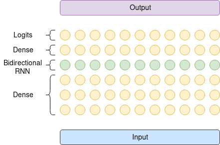
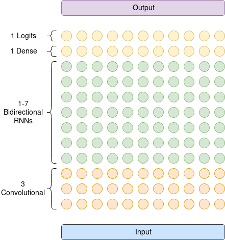

# Single Stage Speech Recognition System using Connectionist Temporal Classification

Automatic Speech Recognition (ASR) system implementation inspired by Baidu's
[Deep Speech: Scaling up end-to-end speech recognition](https://arxiv.org/abs/1412.5567) paper.





## Installation (incomplete)
```bash
git clone https://vcs.zwuenf.org/mdangschat/speech.git
```

### Install Required Libraries
#### Arch Linux
```sh
# This list is incomplete.
pacaur -S tr sox

# Install TensorFlow
pacaur -S python-tensorflow-opt-cuda tensorbaord
```


#### Ubuntu 16.04
```sh
sudo apt install python3-tk sox libsox-fmt-all
```


## Prepare Datasets (deprecated)
```sh
cd <project_root>/data/

cat *_train.txt > train.txt
cat *_text.txt > text.txt
cat *_dev.txt > dev.txt

# Alternatively, only use the desired datasets.
cat libri_speech_train.txt tedlium_train.txt > train.txt
```


## Compile and Install with WarpCTC-Support
### Compile TensorFlow
```sh
# Tensorflow
git clone https://github.com/tensorflow/tensorflow
cd tensorflow

# Checkout the desired version (e.g. rolling `r1.9` or release `v1.9.0`).
git checkout v1.9.0

# Run config wizard
./configure

# Build tensorflow
bazel build --config=opt --config=cuda --cxxopt="-D_GLIBCXX_USE_CXX11_ABI=0" //tensorflow/tools/pip_package:build_pip_package

# Build pip installer
bazel-bin/tensorflow/tools/pip_package/build_pip_package /tmp/tensorflow_pkg

# Install or upgrade package.
sudo pip install /tmp/tensorflow_pkg/tensorflow-X.X.X-cp35-cp35m-linux_x86_64.whl
sudo pip install -U /tmp/tensorflow_pkg/tensorflow-X.X.X-cp35-cp35m-linux_x86_64.whl
```


### Compile WarpCTC
```sh
# Back to base folder
cd ..

# Set environment variables.
export CUDA_HOME="/usr/local/cuda"
export TENSORFLOW_SRC_PATH="/home/marc/workspace/tensorflow"
export WARP_CTC_PATH="/home/marc/workspace/warp-ctc/build"

git clone https://vcs.zwuenf.org/mdangschat/warp-ctc.git
cd warp-ctc

mkdir build && cd build
cmake ../
make

# Install TensorFlow python bindings/
cd ../tensorflow_binding
python setup.py install

# Test Warp CTC.
python setup.py test

```

Reference [Installing TensorFlow from Sources](https://www.tensorflow.org/install/install_sources) 
and [TensorFlow binding for WarpCTC](https://github.com/baidu-research/warp-ctc/tree/master/tensorflow_binding) 
for further informations.


## Training
Start training by invoking `python/train.py`.
Use `python/train.py --delete` to start a clean run and remove the old checkpoints.


## Evaluation
Evaluate the current model by invoking `python/evaluate.py`.
Invoke `python/evaluate.py --test` to run on the test dataset, instead of the development one.
 

## License
To be determined.

<!--
# vim: ts=2:sw=2:et:
-->